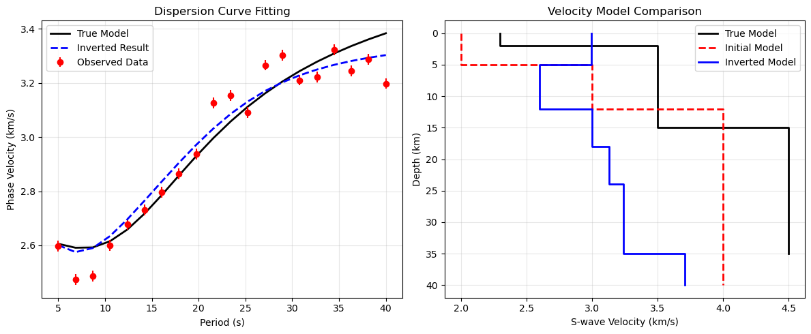

# python dispinversion
=============

# Surface Wave Dispersion Inversion Code for python

## 项目概述
这是一个基于Python实现的频散曲线反演工具，用于从Rayleigh波频散数据反演1D横波速度结构。该代码参考了MATLAB版本的invdispR函数，使用disba库进行正演计算，scipy.optimize进行反演优化。

## AI辅助开发说明
本项目在开发过程中得到了AI编程助手的辅助，主要贡献包括：

代码重构和优化
错误修复和稳定性改进
功能扩展（如层厚变化支持）
文档编写和示例创建
参考的MATLAB代码
本Python实现主要参考了以下MATLAB函数：
https://github.com/jinwar/dispinversion/tree/master
yzinv/invdispR.m - 核心反演函数
dispR_surf96.m - 正演计算函数
make_par_surf96.m - 参数设置函数

## 安装依赖

bash
pip install numpy scipy matplotlib disba
核心功能
### 1. 正演模拟
使用disba库计算Rayleigh波频散曲线：

python
Apply
from dispersion_inversion import DispersionInverter

inverter = DispersionInverter() \n
periods = np.linspace(5, 40, 20) \n
model = np.array([[2, 4.0, 2.3, 2.5],  # [厚度, Vp, Vs, 密度] \n
                  [8, 4.0, 3.5, 2.5],  \n
                  [5, 5.0, 3.5, 2.8]]) \n
predicted_phv = inverter.forward_modeling(periods, model) \n
### 2. 反演功能
支持两种反演模式：

固定层厚反演（默认）

python
Apply
from dispersion_inversion import invdispR

#### 基本反演
inverted_model, predicted_phv = invdispR(
    periods, observed_phv, phv_std, initial_model,
    water_depth=0, crust_thickness=30, n_iterations=500
)
#### 可变层厚反演

python
Apply
from dispersion_inversion import DispersionInverter

inverter = DispersionInverter()
inverted_model, predicted_phv = inverter.invert_with_thickness(
    periods, observed_phv, phv_std, initial_model,
    vary_thickness=True, thickness_bounds_ratio=0.3
)
### 3. 模型创建工具

python
Apply
from utils import create_layered_model

#### 通过界面深度创建模型
depths = np.array([2, 10, 15, 20, 30, 35])
vp = np.array([4.0, 4.0, 5.0, 6.0, 6.0, 6.0])
vs = np.array([2.3, 3.5, 3.5, 4.5, 4.5, 4.5])
model = create_layered_model(depths, vp, vs)
使用示例
基本反演示例

python
Apply
import numpy as np
from dispersion_inversion import invdispR
from utils import create_layered_model

#### 生成合成数据
periods = np.linspace(5, 40, 20)
true_depths = np.array([2, 10, 15, 20, 30, 35])
true_vp = np.array([4.0, 4.0, 5.0, 6.0, 6.0, 6.0])
true_vs = np.array([2.3, 3.5, 3.5, 4.5, 4.5, 4.5])
true_model = create_layered_model(true_depths, true_vp, true_vs)

#### 创建初始模型
init_depths = np.array([5, 12, 18, 24, 35, 40])
init_vp = np.array([4.5, 6.5, 6.0, 6.0, 6.0, 6.0])
init_vs = np.array([2.0, 3.0, 4.0, 4.0, 4.0, 4.0])
initial_model = create_layered_model(init_depths, init_vp, init_vs)

#### 执行反演
inverted_model, predicted_phv = invdispR(
    periods, observed_phv, phv_std, initial_model,
    water_depth=0, crust_thickness=30, n_iterations=500
)

# plainText
linear/
├── dispersion_inversion.py  # 核心反演类
├── utils.py                 # 工具函数
├── example_usage.py         # 使用示例
├── README.md               # 本文档
└── reference_matlab_code/   # MATLAB参考代码 https://github.com/jinwar/dispinversion/tree/master
    ├── invdispR.m
    ├── dispR_surf96.m
    └── ...
与MATLAB版本的比较
相同点
固定层厚反演策略
仅反演横波速度Vs
使用相似的物理约束
改进点
算法: 使用L-BFGS-B优化算法替代线性优化
稳定性: 增强的收敛监控和错误处理
灵活性: 支持层厚变化反演
评估: 多维度拟合质量评估
运行测试

bash
cd /home/data-calc/application/dispinver_liner/linear
python3 example_usage.py
注意事项
模型参数: 确保输入的速度和密度值在合理物理范围内
数据质量: 观测数据应覆盖足够的周期范围
初始模型: 合理的初始模型对反演成功至关重要
计算资源: 可变层厚反演需要更多计算时间
故障排除
如果遇到问题，请检查：

依赖库是否正确安装
模型参数是否合理
观测数据是否包含NaN值
初始模型是否与观测数据匹配
贡献
欢迎提交问题和改进建议。本项目在AI辅助下持续优化和完善。

# 作者提醒
- 如你所见，这个反演代码并没有收敛，尽管现在稳定性有所改善，但是反演模型和正演模型依然存在较大差异。
- 你可以把disba中的PhaseDispersion换成GroupDispersion并自行修改相关正演代码实现群速度反演。我已经加了（
- 大部分是AI辅助开发，参考代码是给AI看的。作者其实不是很懂反演理论。
- 对于使用该代码所产生的任何问题，作者不承担任何责任。
- 希望有大佬能提供帮助，谢谢。
- Email: iceland_spar@hotmail.com